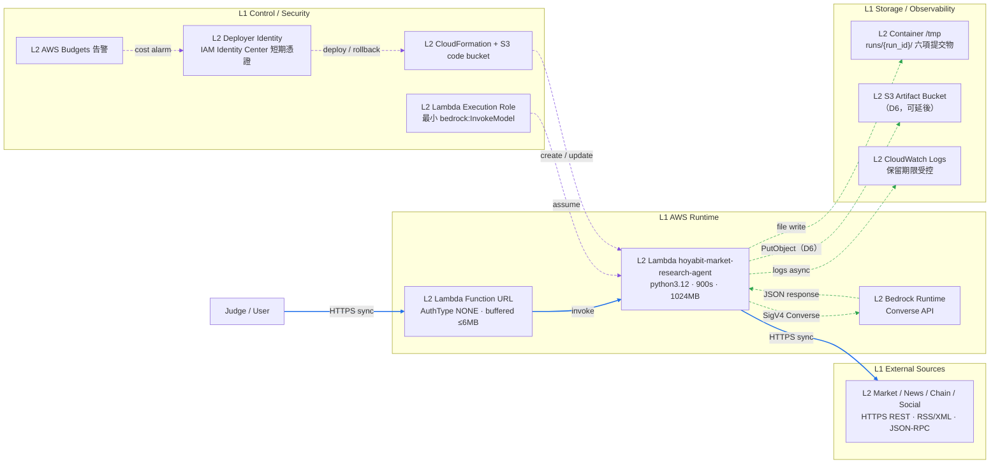
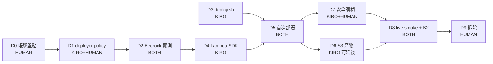

# Design — HoyaBIT AWS 部署上線

## 1. 現況盤點（實測，非推定）

以下狀態於 2026-08-01 在本機實際執行命令確認，`git HEAD = 5f369ce`、工作區乾淨。

### 1.1 已存在的部署資產

| 資產 | 內容 | 可用性 |
|---|---|---|
| `aws/template.yaml` | IAM Role + Lambda（`python3.12`／900s／1024MB）+ Function URL（`AuthType: NONE`）+ `PublicUrl` output | 語法完整，**未部署驗證** |
| `aws/deploy.ps1` | 打包 → S3 上傳 → `cloudformation deploy` → 取 `PublicUrl` | **本機無法執行**（無 pwsh） |
| `lambda_handler.py` | Function URL handler，`/tmp/runs/{run_id}/`，回傳六項提交物 | 程式完整，**未在 Lambda 實測** |
| `src/llm.py` | `_generate_bedrock()` 走 `bedrock-runtime` `Converse`，`boto3` 為 optional import | 已有 mock 測試 |
| `src/artifact_store.py` | 只有 `LocalArtifactStore`（含 SHA-256 manifest） | 無雲端實作 |
| `src/ports.py` | 已凍結 `ArtifactStore` Protocol（T0.5） | 可直接擴充 |

### 1.2 本機環境實測結果

規劃當時（憑證尚未設定）：

```text
aws --version                 → aws-cli/2.36.2 Python/3.14.6 Darwin/23.4.0   可用
aws sts get-caller-identity   → NoCredentials（exit 253）                     阻塞
aws configure list            → profile/access_key/secret_key/region 全 not set
~/.aws                        → 只有空的 cli/ 與 sso/，無 config、無 credentials
which pwsh                    → not found                                    阻塞
python3 --version             → 3.9.6（低於專案要求的 3.10+）
python3 -c "import boto3"     → 1.42.97（botocore 1.42.97）
botocore bedrock-runtime ops  → 'Converse' in operation_names → True
```

憑證設定後（2026-08-01，`aws/verify-permissions.sh` 實跑，12 PASS／0 FAIL）：

```text
sts:GetCallerIdentity  → <ACCOUNT_ID>
                         arn:aws:sts::<ACCOUNT_ID>:assumed-role/WSParticipantRole/Participant
```

這是 AWS Workshop Studio 的臨時參與者環境，不是長期帳號。部署關鍵動作的
`iam:SimulatePrincipalPolicy` 判定全部為 `allowed`：

```text
iam:CreateRole                  allowed     ← 決定部署路線的分水嶺
iam:PassRole                    allowed
iam:GetRole                     allowed
lambda:CreateFunction           allowed
lambda:CreateFunctionUrlConfig  allowed
lambda:UpdateFunctionCode       allowed
cloudformation:CreateStack      allowed
s3:CreateBucket                 allowed
s3:PutObject                    allowed
logs:CreateLogGroup             allowed
```

**因此 `aws/template.yaml` 讓 CloudFormation 自建 Lambda 執行角色的現行寫法可以直接使用**，
不需要改成借用環境預建的角色。

環境中已存在的資源（不要動它們）：

| 資源 | 用途推測 |
|---|---|
| `WSParticipantRole` | 目前使用的參與者角色 |
| `WSLambdaCurtailerRole` | Workshop 的 Lambda 併發抑制機制所用 |
| `WSConcurrencyCurtailer-DO-NOT-USE`（Lambda） | 名稱明示不可使用；暗示環境會監控並限制 Lambda 併發 |

最後一項是 D7 的實質約束：設定 reserved concurrency 時要與這個機制相容，
不要假設可以自由取用帳號的併發額度。

#### Bedrock API key 這條路不適用（已排除）

過程中曾嘗試 Bedrock short-term API key（bearer token）。實測確認 botocore 1.42.97 支援它：
`_get_bearer_env_var_name()` 會把 signing name `bedrock` 轉成環境變數
`AWS_BEARER_TOKEN_BEDROCK`，而 `bedrock-runtime` 的 auth traits 含
`smithy.api#httpBearerAuth`，所以 `src/llm.py` 不需要任何修改就能使用。

但該次實測回 `AccessDeniedException: Authentication failed`，且**這條路對本專案沒有價值**：
API key 只能呼叫 Bedrock，無法執行 CloudFormation、Lambda 或 IAM 操作，因此不能用於部署。
主線一律使用 Workshop Studio 提供的標準 AWS 憑證（SigV4）。

記錄此結論的目的是避免後續有人重複這條繞路。

**對既有 blocker B2 的修正**：`docs/COMPETITION_BLOCKERS.md` 的 B2 把根因記為「本機未安裝
boto3」。實測顯示本機 `python3` 已有 boto3 1.42.97 且含 `Converse` operation
（位於 `~/Library/Python/3.9/lib/python/site-packages/`）。因此 B2 的**現行阻塞點是缺少 AWS
credentials 與模型存取權，不是缺少 SDK**。這個修正必須在 D8 回寫 blocker 文件時一併更正，
否則後續讀者會照錯誤的根因去裝套件。

### 1.3 缺口清單

| # | 缺口 | 對應需求 | 嚴重度 |
|---|---|---|---|
| G1 | 本機無任何 AWS 憑證與 region 設定 | R1 | 阻塞全部 |
| G2 | 無 deployer 權限定義（無 IAM policy 檔） | R1 | 阻塞 |
| G3 | 目標 region 的模型可呼叫形式未驗證 | R2 | 阻塞 |
| G4 | 無 bash 部署腳本；`deploy.ps1` 不支援 `bedrock` 與 model ID 覆寫 | R3 | 阻塞 |
| G5 | Lambda 內建 SDK 版本可能不含 `Converse` | R4 | 高 |
| G6 | Function URL buffered 回應上限 6 MB，六檔可能超限 | R5 | 中 |
| G7 | 產物只寫容器 `/tmp`，無 `S3ArtifactStore` | R6 | 中 |
| G8 | `AuthType: NONE` 公開端點，無 concurrency 上限、無 log 保留期 | R7 | 中 |
| G9 | 無成本告警 | R8 | 中 |
| G10 | `docs/aws-architecture.md` 內容落後（仍寫 OpenAI Responses API、300s timeout） | R10 | 低 |

## 2. 目標架構

部署形態刻意維持最小：**單一 Lambda + Function URL + CloudFormation**。不引入 API Gateway、
容器或編排服務，理由是這些都不會改善競賽驗收項目（可追溯性、可解釋性、時限內產出），
卻會增加部署失敗面。



藍實線為請求／資料主路徑，綠虛線為證據與產物流，紫虛線為控制與安全平面。
`S3 Artifact Bucket` 以虛線標示，代表 D6 尚未實作、可延後但不可誤稱完成。

### 2.1 責任邊界（沿用既有分層，不變動）

部署不改變 `.kiro/steering/structure.md` 定義的邊界。Lambda 只是 `src/orchestrator.py` 的
另一個呼叫端，與 `src/app.py` 平行：

```text
lambda_handler.handler()  →  src.orchestrator.run()  →  既有三階段管線
src.app.Handler           →  src.orchestrator.run()  →  同一條管線
```

因此雲端與本機的判斷結果一致；差異只在產物落點與 provider 可用性。

## 3. 關鍵技術決策

### D-1：region 與 model ID 必須實測決定，不預先寫死

**問題**：`aws/template.yaml` 與 `.env.example` 目前預設 `ap-northeast-1` +
`amazon.nova-lite-v1:0`，而 IAM policy 只授權：

```text
arn:${AWS::Partition}:bedrock:${AWS::Region}::foundation-model/${BedrockModelId}
```

AWS 文件顯示 Amazon Nova understanding 模型在 Asia Pacific（含 Tokyo）是
[透過 cross-Region inference profile 提供](https://aws.amazon.com/about-aws/whats-new/2025/02/amazon-nova-understanding-models-europe-asia-pacific)。
若該 region 需要 inference profile，則：

- `modelId` 要用 profile ID（例如 `apac.amazon.nova-lite-v1:0`），不是裸 foundation model ID；
- IAM 要同時授權 **inference profile ARN** 與**目的 region 的 foundation model ARN**，
  否則會拿到 `AccessDeniedException`（[cross-Region inference 前置條件](https://docs.aws.amazon.com/bedrock/latest/userguide/cross-region-inference-prereq.html)）。

**決策**：不在規劃階段斷言哪一種形式可用。D2 用 CLI 與一次最小 `Converse` 實測，
以實測結果回填 `BEDROCK_MODEL_ID` 與 IAM Resource 清單。

**備援順序**：
1. 目標 region 直接可呼叫 foundation model → 用現有設定，IAM 最簡單。
2. 目標 region 需 inference profile → 改用 profile ID + 擴充 IAM Resource。
3. 兩者皆不可 → 改 region（`us-east-1` 的模型可用性最廣），並同步更新 template 預設值。

> 內容依授權要求改寫並摘要自 AWS 官方文件。

#### 實測結果（2026-08-01，走備援順序第 1 條）

在帳號 `<ACCOUNT_ID>`（`WSParticipantRole/Participant`）實測 `Converse`。
兩個 region 都測過，因為部署 region 最終定為 **`us-west-2`**（競賽環境指定）：

| model ID | `us-east-1` | `us-west-2`（部署用） |
|---|---|---|
| `amazon.nova-lite-v1:0` | 成功 | **成功** |
| `us.amazon.nova-lite-v1:0` | 成功 | 成功（cross-Region profile，非必要） |
| `apac.amazon.nova-lite-v1:0` | `ValidationException: invalid model identifier` | 同左 |
| `amazon.nova-micro-v1:0` | 成功 | **失敗**：`on-demand throughput isn't supported` |
| `us.amazon.nova-micro-v1:0` | 成功 | 成功 |

**結論：本決策原先擔憂的 inference profile 問題在 `us-west-2` 不存在。**
`amazon.nova-lite-v1:0` 的裸 foundation model ID 可直接呼叫，因此
`aws/template.yaml` 既有的資源條件

```text
arn:${AWS::Partition}:bedrock:${AWS::Region}::foundation-model/${BedrockModelId}
```

是正確且最小的，**不需要擴充成同時涵蓋 inference profile**。§1.3 的缺口 G3 據此關閉。

同時這組實測把原本的理論擔憂變成了具體證據：**同一個帳號、同一個模型家族，換一個 region
就有不同的可用形式**——`nova-micro` 的裸 ID 在 `us-east-1` 可用、在 `us-west-2` 必須改用
`us.` 前綴的 profile。因此「切換 region 必須重跑 `aws/verify-permissions.sh` 第 3 項」
不是保守建議，而是已被觀測到的失敗模式。

保留亞太區的原始擔憂記錄而非刪除：Nova 在 `ap-northeast-1` 需要 `apac.` 前綴的 profile，
屆時 IAM 就必須擴充。

### D-2：Lambda 的 AWS SDK 版本要顯式控制

**問題**：Lambda 受管 runtime 內建 boto3，但版本落後於 runtime 發布時點是常態。
AWS 自己的知識庫記載，用 Lambda 呼叫 Bedrock 時可能出現
[`Unknown service: 'bedrock'` 而需自行升級 boto3／botocore](https://repost.aws/knowledge-center/lambda-upgrade-boto3-botocore)。
本專案的失敗模式更隱蔽：`src/llm.py` 的 Bedrock 失敗會被 orchestrator 攔下並降級成
deterministic fallback，**執行仍成功、報告仍產出**，只是模型路徑沒跑。這正是 B2 的形狀，
在雲端重演會讓人誤以為部署成功。

**決策**：部署包顯式帶入已知支援 `Converse` 的 `boto3`／`botocore`，pin 到確定版本
（本機實測可用的 1.42.97 是合理起點）。實作方式二選一，D4 依實測 zip 大小決定：

| 方式 | 優點 | 缺點 |
|---|---|---|
| 打包進 function zip | 單一產物、無額外資源 | zip 變大，冷啟動略慢 |
| Lambda Layer | function 程式碼小、layer 可重用 | 多一個資源與版本要管 |

**與零第三方相依原則的關係**（必須寫清楚，否則像是違規）：
`.kiro/steering/tech.md` 的約束是**專案 runtime 不依賴第三方套件**——任何人 clone 下來
`python -m src.app` 就能跑。這條約束不變：

- `src/llm.py` 對 boto3 是 `try/except ImportError` 的 optional import；
- `tests/` 全程 mock，不需要 boto3；
- boto3 只出現在**部署包**與 AWS 執行環境，屬於「部署目標環境的一部分」，
  等同 Lambda runtime 本身，不是專案原始碼的相依。

D4 必須有一項驗收明確證明這點：在沒有 boto3 的環境下，測試套件與離線端到端仍全數通過。

### D-3：回應大小與產物落點分開處理

Function URL 預設 buffered 呼叫，
[payload 上限為 6 MB](https://docs.aws.amazon.com/lambda/latest/dg/config-rs-invoke-furls.html)。
`lambda_handler.py` 目前把六項提交物的**完整內容**塞進 JSON 回應。`evidence.json` 帶完整
content 與長數列時體積可觀，超限會直接讓回應失敗——而此時管線其實已成功，產物也已寫入
`/tmp`，屬於「白做工」的失敗。

**決策**：分成兩件事，不混在一起解。

1. **D5（必做）**：實測回應大小。超限就把 JSON 回應改為「摘要 + 產物參照」，
   完整內容留在產物落點。這是保護性改動，不改變任何研究邏輯。
2. **D6（可延後）**：新增 `S3ArtifactStore` 讓產物在執行結束後仍可取得。
   透過 T0.5 已凍結的 `ArtifactStore` Protocol 擴充，`src/orchestrator.py` 不需改動。

D6 未做時，系統仍可用，但必須誠實標示「產物為容器本地暫存」。**不得**因為 Lambda 回應
含有六檔內容，就宣稱產物已持久化。

### D-4：公開端點的風險用「限制 + 拆除」而非「加認證」來收斂

`AuthType: NONE` + `Principal: '*'` 意味著任何拿到 URL 的人都能觸發完整研究執行，
消耗 Bedrock token 與 Lambda 時間。Demo 情境下這是刻意的取捨（評審不需要憑證），
但必須有天花板。

**決策**：不在 Demo 前改認證機制（會增加現場失敗風險），改用三層護欄：

1. **reserved concurrency 上限**：限制同時執行數，成本有硬上限。
2. **CloudWatch log 保留期限**：避免無限累積儲存費。
3. **Budgets 告警 + Demo 後拆除**：`delete-stack` 是最有效的收斂手段。

`AuthType: AWS_IAM` 與共享 secret 標頭列為**可選**，在 `tasks.md` 的 D7 提供做法，
但不設為驗收條件——現場改認證的風險高於它降低的風險。

### D-5：部署腳本補 bash 版，而非改寫 PowerShell 版

本機沒有 pwsh，`deploy.ps1` 完全無法執行。新增 `aws/deploy.sh` 與之對等，並補上
`deploy.ps1` 缺的兩件事（`bedrock` provider 值、`BedrockModelId` 傳遞）。
保留 `deploy.ps1` 不刪除——Windows 環境仍可能用到，且刪除既有可用資產不在範圍內。

`--dry-run` 是刻意加入的：它讓打包邏輯可以在完全沒有 AWS 憑證的情況下被測試，
把 G1（無憑證）與 G4（無腳本）解耦，兩件事可以並行推進。

## 4. 任務依賴與並行性



**D3 不依賴任何 AWS 權限**，因此在等待 D0–D2 的人工步驟時，D3 可以先做完。
這是唯一真正可並行的一段，其餘為線性依賴。

## 5. 風險登記

| ID | 風險 | 觸發徵兆 | 緩解 | 若無法緩解 |
|---|---|---|---|---|
| RK1 | 帳號屬 Organization 且 SCP 禁用 Bedrock | 權限齊備仍 `AccessDeniedException` | 請 Organization 管理者放行 | 全程 offline Demo，D 任務 `BLOCKED` |
| RK2 | 目標 region 無可用模型形式 | `list-foundation-models` 找不到目標 | 依 D-1 備援順序換 profile 或換 region | 保留 offline fallback，D8 `FAIL` |
| RK3 | Lambda SDK 不含 `Converse` | 雲端 stage 降級但無明確錯誤 | 依 D-2 顯式打包 SDK | 記為已知限制，不宣稱 live 成功 |
| RK4 | 回應超過 6 MB | Function URL 回應失敗但 log 顯示管線成功 | 依 D-3 改回產物參照 | 只回 `report.md`，其餘給參照 |
| RK5 | 公開 URL 被大量呼叫 | Budgets 告警、Bedrock throttling | reserved concurrency + 立即 `delete-stack` | 拆除 stack，改本機 Demo |
| RK6 | 冷啟動 + 11 個 collector 逼近 900s | Lambda timeout 或收尾窗口被觸發 | 既有 deadline 管理已夾在 900s 內（T7） | 收尾窗口跳過模型呼叫，六檔仍產出 |
| RK7 | 部署改動造成本機 regression | 541 tests 出現失敗 | 每個 D 任務都跑完整套件 | 回滾該任務的 commit |

## 6. 不做的事與理由

| 不做 | 理由 |
|---|---|
| 把 `src/app.py` 完整 UI 上雲 | 它綁 `127.0.0.1` 且用 `ThreadingHTTPServer`，需要 Web Adapter 或容器；完整 UI 以本機展示即可滿足驗收 |
| API Gateway / CloudFront / WAF | 不改善任何驗收項目，且 API Gateway 的 29 秒上限反而會破壞長時間執行 |
| CDK / SAM / Terraform 取代現有 IaC | 現有 CloudFormation 已可用，換工具是純風險 |
| CI/CD pipeline | 一次性部署，自動化投報率為負 |
| 多 region / 多帳號 | 超出 Demo 需求 |
| 改動研究邏輯 | T8 已 feature freeze；部署不是改功能的藉口 |

## 7. 與既有文件的關係

| 文件 | 本 spec 的處理 |
|---|---|
| `docs/aws-architecture.md` | D8 更新為實際部署狀態；保留既有 zone 表結構 |
| `docs/COMPETITION_BLOCKERS.md` | D8 更新 B2（含 §1.2 的根因修正） |
| `docs/COMPETITION_TASK_STATUS.yaml` | D8 更新 T8；D0–D7 不動此檔 |
| `docs/COMPETITION_BASELINE.md` | 不修改，保留 T0 歷史紀錄 |
| `.kiro/steering/*.md` | 不修改；D4 的 SDK 打包決策在本文件說明與 `tech.md` 的關係 |
| `demo-fixtures/competition-ready/` | 不刪除任何備案 fixture |

## 參考來源

- [Lambda Function URL 回應模式與 6 MB buffered 上限](https://docs.aws.amazon.com/lambda/latest/dg/config-rs-invoke-furls.html)
- [Lambda 配額（15 分鐘執行上限）](https://docs.aws.amazon.com/lambda/latest/dg/gettingstarted-limits.html)
- [升級 Lambda 中的 boto3／botocore 以呼叫 Bedrock](https://repost.aws/knowledge-center/lambda-upgrade-boto3-botocore)
- [Bedrock 模型存取](https://docs.aws.amazon.com/bedrock/latest/userguide/model-access.html)
- [簡化的 Bedrock 模型存取（2025-10）](https://aws.amazon.com/blogs/security/simplified-amazon-bedrock-model-access)
- [cross-Region inference 前置條件與 IAM](https://docs.aws.amazon.com/bedrock/latest/userguide/cross-region-inference-prereq.html)
- [Amazon Nova understanding 模型在歐洲與亞太的可用性](https://aws.amazon.com/about-aws/whats-new/2025/02/amazon-nova-understanding-models-europe-asia-pacific)

外部來源內容均經改寫與摘要，以符合授權限制。
