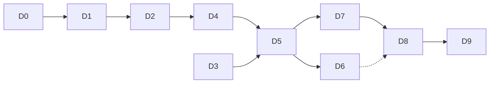

# Implementation Plan — HoyaBIT AWS 部署上線

> **執行模式**：手動，一次一個 Task。不要用 Run All Tasks。
> 每個 Task 完成後停止，不自動開始下一個。

執行每個 Task 前：

1. 讀本檔對應 Task 段落與 `design.md` 的相關決策。
2. 確認依賴 Task 在 `status.yaml` 中為 `PASS`。
3. 把該 Task 狀態改為 `IN_PROGRESS`。
4. 遵守 workspace steering，特別是零第三方相依與 offline fallback 保護。
5. 完成實作、測試、狀態更新與 commit。
6. 停止。

**`HUMAN` 任務不需要 commit**，但必須在 `status.yaml` 記錄實際輸出摘要（不含任何憑證）。

---

## 任務總覽

| ID | 標題 | 執行者 | 依賴 | 目標時間 | 阻塞性 |
|---|---|---|---|---:|---|
| D0 | AWS 帳號與 region 決策 | `HUMAN` | — | 15 min | 阻塞全部 |
| D1 | Deployer 權限落地與預檢腳本 | `KIRO` + `HUMAN` | D0 | 45 min | 阻塞 D2+ |
| D2 | Bedrock 模型實測與設定回填 | `BOTH` | D1 | 45 min | 阻塞 D4、D5 |
| D3 | 跨平台部署腳本 | `KIRO` | — | 60 min | 阻塞 D5 |
| D4 | Lambda AWS SDK 相容性 | `KIRO` | D2 | 45 min | 阻塞 D5 |
| D5 | 首次部署與驗收 | `BOTH` | D2, D3, D4 | 60 min | 阻塞 D6+ |
| D6 | S3 產物持久化 | `KIRO` | D5 | 60 min | 可延後 |
| D7 | 安全與成本護欄 | `KIRO` + `HUMAN` | D5 | 45 min | 建議必做 |
| D8 | Live smoke、B2 解除與文件同步 | `BOTH` | D7 | 45 min | 競賽必做 |
| D9 | 資源拆除與權限撤銷 | `HUMAN` | D8 | 20 min | 收尾 |

**最小可展示路徑**：D0 → D1 → D2 → D3 → D4 → D5 → D7 → D8。D6 可延後。
**D3 不需要任何 AWS 權限**，可在等 D0–D2 的人工步驟時先做完。

---

- [ ] **D0. AWS 帳號與 region 決策** `HUMAN`
  - 讀 `aws-permissions-guide.md` §0–§1，填好那張佔位符表。
  - 確認帳號類型（個人／組織成員／競賽提供），若為組織成員先確認是否有 SCP 限制。
  - 決定 `<REGION>`。**已定案 `us-west-2`**（競賽環境指定），實測結果見 `design.md` 決策 D-1。
  - 確認可登入 Console 並已切到該 region。
  - **不要**在此步驟建立任何資源或 access key。
  - _驗收：_
    - [ ] `<ACCOUNT_ID>`、`<REGION>`、`<STACK_NAME>` 三個值已確定並回報給 Kiro
    - [ ] 已確認帳號類型與是否需要向 Organization 管理者申請
  - _Requirements: 1.1, 1.4, 2.1_
  - _Depends: none_
  - _Commit: 無（純決策，無檔案變更）_
  - _Stop after Task: mandatory_

---

- [ ] **D1. Deployer 權限落地與預檢腳本** `KIRO` + `HUMAN`
  - **`HUMAN` 部分**：依 `aws-permissions-guide.md` §2–§4 建立部署身分、貼上 deployer policy、
    設定本機 profile，直到 `aws sts get-caller-identity` 成功。
  - **`KIRO` 部分**：
    - 新增 `aws/iam/deployer-policy.json`，內容即 guide §3.1 的 JSON，佔位符保持為佔位符
      （不寫入真實 account ID）。
    - 新增 `aws/verify-permissions.sh`，內容即 guide §6 的腳本，加上 `chmod +x`。
    - 新增 `aws/README.md` 說明三個檔案（`template.yaml`／`deploy.ps1`／新增檔）的用途與執行順序。
  - _In Scope：_ `aws/iam/deployer-policy.json`、`aws/verify-permissions.sh`、`aws/README.md`
  - _Out of Scope：_ 不改 `aws/template.yaml`（D2 才改）；不改任何 `src/` 檔案
  - _驗收：_
    - [ ] `aws sts get-caller-identity` 回傳 Account 與 Arn
    - [ ] `bash aws/verify-permissions.sh` 全部項目 PASS
    - [ ] 部署身分未附加 `AdministratorAccess`
    - [ ] `aws/iam/deployer-policy.json` 可被 `python3 -m json.tool` 解析
    - [ ] 完整測試套件 541 tests 通過（確認未影響既有程式）
  - _測試命令：_
    ```bash
    python3 -m json.tool aws/iam/deployer-policy.json > /dev/null && echo "policy JSON OK"
    bash -n aws/verify-permissions.sh && echo "script syntax OK"
    AWS_PROFILE=hoyabit REGION=<REGION> bash aws/verify-permissions.sh
    python3 -m unittest discover -s tests
    ```
  - _Requirements: 1.1, 1.2, 1.3, 1.5_
  - _Depends: D0_
  - _Commit: `chore(D1): add deployer iam policy and permission preflight`_
  - _Blocker fallback：_ 權限 20 分鐘內無法通過 → 記錄到 `docs/COMPETITION_BLOCKERS.md`，
    標記 `BLOCKED`，改以本機 Demo 為展示路徑，**不要**改用 `AdministratorAccess` 硬過
  - _Stop after Task: mandatory_

---

- [ ] **D2. Bedrock 模型實測與設定回填** `BOTH`
  - 依 `aws-permissions-guide.md` §5 實測，決定 `<MODEL_ID>` 的正確形式
    （裸 foundation model ID 或 inference profile ID）。
  - **`KIRO` 依實測結果回填三處**：
    - `.env.example` 的 `AWS_REGION`、`BEDROCK_MODEL_ID`
    - `aws/template.yaml` 的 `BedrockModelId` 參數預設值
    - `aws/template.yaml` 的 `InvokeConfiguredBedrockModel` policy：目前只授權
      `arn:${AWS::Partition}:bedrock:${AWS::Region}::foundation-model/${BedrockModelId}`，
      需擴充為同時涵蓋 inference profile ARN 與跨區 foundation model ARN。
      這是 `design.md` 決策 D-1 與 guide §7 記載的已知缺口。
  - `aws/template.yaml` 的 `LLMProvider` 已含 `bedrock`，不需改動。
  - _In Scope：_ `.env.example`、`aws/template.yaml`、`tests/test_bedrock_adapter.py`（IAM 字串檢查）
  - _Out of Scope：_ 不改 `src/llm.py` 的呼叫邏輯；不部署 stack
  - _驗收：_
    - [ ] guide §5.4 的最小 `Converse` 實測印出非空回應
    - [ ] `aws cloudformation validate-template` 對修改後的 template 通過
    - [ ] template 的 Bedrock policy 同時含 foundation model 與 inference profile 資源
    - [ ] `.env.example` 只有變數名稱與非敏感預設值，無任何金鑰
    - [ ] 完整測試套件通過
  - _測試命令：_
    ```bash
    AWS_PROFILE=hoyabit REGION=<REGION> MODEL_ID=<MODEL_ID> python3 - <<'PY'
    # guide §5.4 的實測腳本
    PY
    aws cloudformation validate-template --region <REGION> \
        --template-body file://aws/template.yaml
    python3 -m unittest tests.test_bedrock_adapter -v
    python3 -m unittest discover -s tests
    ```
  - _Requirements: 2.1, 2.2, 2.3, 2.4, 2.5_
  - _Depends: D1 PASS_
  - _Blocker fallback：_ 任何 region 都無法呼叫模型 → 記錄實際錯誤訊息與已試過的 region／model ID
    組合，標記 `BLOCKED`，D8 記為 `FAIL` 並保留 B2；**不得**因此刪除 offline fallback
  - _Commit: `fix(D2): align bedrock model id and iam resources with tested region`_
  - _Stop after Task: mandatory_

---

- [ ] **D3. 跨平台部署腳本** `KIRO`
  - 新增 `aws/deploy.sh`，與 `aws/deploy.ps1` 行為對等：打包 → 建立／確認 S3 bucket →
    上傳 zip → `cloudformation deploy` → 輸出 `PublicUrl`。
  - 補上 `deploy.ps1` 目前缺的兩件事，兩個腳本都要有：
    - `bedrock` 作為合法的 provider 值（`deploy.ps1` 的 `ValidateSet` 目前只有 `gemini`／`openai`）
    - 可傳遞 `BedrockModelId` 到 CloudFormation
  - 實作 `--dry-run`：產生 zip 後結束，不呼叫任何 AWS API。
  - 打包內容：`lambda_handler.py`、`src/`、`data/`。排除 `.env`、`__pycache__`、
    `outputs-*/`、`.git/`、`tests/`。
  - 憑證不可用時保留 zip 並輸出可行動的錯誤訊息。
  - 保留 `deploy.ps1`，不刪除。
  - _In Scope：_ `aws/deploy.sh`（新增）、`aws/deploy.ps1`（補參數）、`aws/README.md`（更新用法）
  - _Out of Scope：_ 不部署；不改 `aws/template.yaml`；不改任何 `src/` 檔案
  - _驗收：_
    - [ ] `bash -n aws/deploy.sh` 語法檢查通過
    - [ ] `bash aws/deploy.sh --dry-run` 在**無 AWS 憑證**的情況下成功產生 zip
    - [ ] zip 內含 `lambda_handler.py`、`src/`、`data/`
    - [ ] zip 內**不含** `.env`、`__pycache__`、`outputs-*`、`.git`、`tests`
    - [ ] `--help` 可讀且列出所有參數
    - [ ] `deploy.ps1` 接受 `bedrock` 且能傳 `BedrockModelId`
    - [ ] 完整測試套件通過
  - _測試命令：_
    ```bash
    bash -n aws/deploy.sh
    bash aws/deploy.sh --help
    ( unset AWS_PROFILE AWS_ACCESS_KEY_ID AWS_SECRET_ACCESS_KEY; \
      bash aws/deploy.sh --dry-run )
    unzip -l aws/.build/agent.zip | grep -E "lambda_handler|src/|data/"
    unzip -l aws/.build/agent.zip | grep -E "\.env|__pycache__|outputs-|\.git|tests/" \
      && echo "FAIL: 打包含有不該有的內容" || echo "PASS: 打包內容乾淨"
    python3 -m unittest discover -s tests
    ```
  - _Requirements: 3.1, 3.2, 3.3, 3.4, 3.5, 3.6_
  - _Depends: none（可與 D0–D2 並行）_
  - _Commit: `feat(D3): add posix deploy script and bedrock parameters`_
  - _Stop after Task: mandatory_

---

- [ ] **D4. Lambda AWS SDK 相容性** `KIRO`
  - 依 `design.md` 決策 D-2，讓 Lambda 執行環境確定具備支援 `Converse` 的 boto3／botocore。
  - 二選一，依實測 zip 大小決定，並把選擇理由寫進 `aws/README.md`：
    - **方式 A**：`pip3 install --target` 把 pin 版 boto3／botocore 裝進部署包
    - **方式 B**：建立 Lambda Layer（`aws/template.yaml` 新增 `AWS::Lambda::LayerVersion`）
  - 版本 pin 到確定值（本機實測可用的 `1.42.97` 是合理起點），**不使用開放版本範圍**。
  - 在 `lambda_handler.py` 或 `src/llm.py` 加一行可辨識的啟動期 log，記錄實際生效的
    botocore 版本與 `Converse` 是否可用。目的是讓雲端降級有根因可查，不是靜默 fallback。
  - **必須證明本機路徑未被污染**：在沒有 boto3 的環境下測試套件與離線端到端仍通過。
  - _In Scope：_ `aws/deploy.sh`、`aws/deploy.ps1`、`aws/template.yaml`（若選方式 B）、
    `lambda_handler.py`（版本 log）、`aws/README.md`
  - _Out of Scope：_ 不新增 `requirements.txt` 作為專案相依；不改 `src/llm.py` 的 Bedrock 呼叫邏輯；
    不讓任何 `src/` 模組把 boto3 變成硬性 import
  - _驗收：_
    - [ ] 部署包內含或 Layer 提供 pin 版 boto3／botocore
    - [ ] `python3 -c "import botocore.session; ..."` 確認打包版本含 `Converse` operation
    - [ ] 在隔離環境（無 boto3）執行完整測試套件 → 541 tests 通過
    - [ ] 在隔離環境執行離線端到端 → 六項提交物齊備、manifest hash 相符
    - [ ] zip 大小在 Lambda 限制內（未壓縮 250 MB、壓縮 50 MB）
    - [ ] `design.md` 決策 D-2 的「與零第三方相依原則的關係」已在 `aws/README.md` 複述
  - _測試命令：_
    ```bash
    bash aws/deploy.sh --dry-run
    ls -lh aws/.build/agent.zip
    unzip -l aws/.build/agent.zip | grep -c botocore

    # 證明本機路徑不需要 boto3
    python3 -c "import sys; sys.modules['boto3']=None; import src.llm; print('optional import OK')"
    python3 -m unittest discover -s tests
    python3 -c "from pathlib import Path; from src.orchestrator import run; \
      run('ETH', 'D4 隔離環境 offline smoke', Path('outputs-d4'), live=False, use_llm=False)"
    ```
  - _Requirements: 4.1, 4.2, 4.3, 4.4, 4.5_
  - _Depends: D2 PASS_
  - _Commit: `fix(D4): pin aws sdk in lambda package for bedrock converse`_
  - _Blocker fallback：_ zip 超限或打包失敗 → 改方式 B（Layer）；兩者都失敗則記錄為
    `PARTIAL`，並在 D5 明確驗證雲端是否降級，不得宣稱 live 成功
  - _Stop after Task: mandatory_

---

- [ ] **D5. 首次部署與驗收** `BOTH`
  - 執行 `bash aws/deploy.sh`，取得 Function URL。
  - 依下方驗收清單逐項確認。**「命令沒報錯」不算部署成功。**
  - 依 `design.md` 決策 D-3 實測回應大小：若六項提交物的完整內容使回應超過 6 MB，
    把 `lambda_handler.py` 的 JSON 回應改為「摘要 + 產物參照」，完整內容留在產物落點。
    這是保護性改動，不得改變任何研究邏輯。
  - _In Scope：_ 部署執行、`lambda_handler.py`（僅在超限時調整回應形狀）、
    `status.yaml`（記錄實際驗收輸出）
  - _Out of Scope：_ 不改 `src/orchestrator.py`；不新增 AWS 資源（D6／D7 的事）
  - _驗收：_
    - [ ] `describe-stacks` 回報 `CREATE_COMPLETE` 或 `UPDATE_COMPLETE`
    - [ ] `GET <FunctionUrl>` 回 HTTP 200 且含輸入表單
    - [ ] `POST` with `mode=test` 在 timeout 內回應，且含六項提交物（或超限時的產物參照）
    - [ ] `manifest.json` 的五個 SHA-256 可驗證相符
    - [ ] Citation Gate 為 `PASS`
    - [ ] 同題目連續兩次 `mode=formal` → 第二次回 409（formal lock 在雲端生效）
    - [ ] CloudWatch Logs 找得到該 `run_id`
    - [ ] CloudWatch Logs **不含**任何 API key、access key 或 token
    - [ ] `execution_log.json` 的分析與 Critic stage 狀態已記錄（成功或降級都要如實回報）
    - [ ] 完整測試套件通過
  - _測試命令：_
    ```bash
    export AWS_PROFILE=hoyabit REGION=<REGION>
    bash aws/deploy.sh --region "$REGION" --provider bedrock --model-id <MODEL_ID>

    URL=$(aws cloudformation describe-stacks --region "$REGION" \
      --stack-name hoyabit-agent-mvp \
      --query "Stacks[0].Outputs[?OutputKey=='PublicUrl'].OutputValue" --output text)

    curl -sS -o /dev/null -w "GET %{http_code}\n" "$URL"

    curl -sS -X POST "$URL" -H 'content-type: application/json' \
      -d '{"coin":"ETH","question":"雲端部署驗收","mode":"test"}' \
      | python3 -m json.tool | head -40

    curl -sS -X POST "$URL" -H 'content-type: application/json' \
      -d '{"coin":"ETH","question":"formal lock 驗收","mode":"formal"}' -o /tmp/f1.json -w "%{http_code}\n"
    curl -sS -X POST "$URL" -H 'content-type: application/json' \
      -d '{"coin":"ETH","question":"formal lock 驗收","mode":"formal"}' -o /tmp/f2.json -w "%{http_code}\n"

    aws logs tail /aws/lambda/hoyabit-market-research-agent --region "$REGION" --since 10m
    python3 -m unittest discover -s tests
    ```
  - _Requirements: 5.1, 5.2, 5.3, 5.4, 5.5, 5.6_
  - _Depends: D2 PASS, D3 PASS, D4 PASS_
  - _Commit: `feat(D5): verify first aws deployment and guard response size`_
  - _Blocker fallback：_ stack 建立失敗 → 讀 `describe-stack-events` 最早的失敗事件，
    修對應權限或參數；20 分鐘無解則 `delete-stack` 回到乾淨狀態並記錄 `BLOCKED`
  - _Stop after Task: mandatory_

---

- [ ] **D6. S3 產物持久化** `KIRO`（可延後）
  - 新增 `S3ArtifactStore`，實作 `src/ports.py` 已凍結的 `ArtifactStore` Protocol，
    與 `LocalArtifactStore` 介面一致（`write_bytes`／`write_text`／`write_json`／
    `finalize_manifest`／`for_run`）。
  - `aws/template.yaml` 新增產物 bucket（名稱前綴 `hoyabit-agent-artifacts-`），
    並在 Lambda execution role 加上限定該 bucket 的 `s3:PutObject`。
  - bucket 必須封鎖公開存取；存取限 Lambda execution role 與部署身分。
  - `lambda_handler.py` 依環境變數選擇 store：有 bucket 用 S3，沒有就用 Local。
  - **不修改 `src/orchestrator.py`**——這是 T0.5 凍結介面的目的。
  - _In Scope：_ `src/artifact_store.py`、`aws/template.yaml`、`lambda_handler.py`、
    `src/run_context.py`（若需新環境變數名稱）、新增測試
  - _Out of Scope：_ 不改 orchestrator 產出邏輯；不改 manifest 結構；不加 S3 生命週期規則
  - _驗收：_
    - [ ] 新增測試全程 mock，不呼叫真實 S3
    - [ ] `S3ArtifactStore` 與 `LocalArtifactStore` 的 manifest 結構一致
    - [ ] `manifest.json` 的 URI 指向實際 S3 落點，SHA-256 與內容相符
    - [ ] bucket 的 public access block 已啟用
    - [ ] 未設定 bucket 時自動退回 `LocalArtifactStore`，行為與 D5 相同
    - [ ] 雲端執行後，六項提交物可在執行結束後用 `aws s3 cp` 取回
    - [ ] 完整測試套件通過（測試數應增加）
  - _測試命令：_
    ```bash
    python3 -m unittest tests.test_d6_s3_artifact_store -v
    python3 -m unittest discover -s tests
    aws s3 ls "s3://hoyabit-agent-artifacts-<ACCOUNT_ID>-<REGION>/runs/" --region <REGION>
    ```
  - _Requirements: 6.1, 6.2, 6.3, 6.4, 6.5_
  - _Depends: D5 PASS_
  - _Commit: `feat(D6): add s3 artifact store for cloud runs`_
  - _降級：_ 時間不足時跳過本 Task。系統仍可運作，但必須在 `status.yaml` 與報告
    誠實標示「產物為容器本地暫存」，**不得**因 Lambda 回應含六檔內容就宣稱已持久化
  - _Stop after Task: mandatory_

---

- [ ] **D7. 安全與成本護欄** `KIRO` + `HUMAN`
  - **`KIRO`**：`aws/template.yaml` 加入三項護欄
    - Lambda `ReservedConcurrentExecutions`（建議 2–5），讓失控呼叫的成本有硬上限
    - 顯式 `AWS::Logs::LogGroup` 並設 `RetentionInDays`（建議 7 或 14），不使用永久保留
    - 一個可選參數（預設關閉）讓 Function URL 可切成 `AuthType: AWS_IAM`
  - **`KIRO`**：在 `aws/README.md` 明確寫出 `AuthType: NONE` 的風險：
    任何取得 URL 的人都能觸發完整執行並消耗模型配額。
  - **`HUMAN`**：依 `aws-permissions-guide.md` §8 建立 AWS Budgets 告警。
  - _In Scope：_ `aws/template.yaml`、`aws/README.md`、`tests/`（template 字串檢查）
  - _Out of Scope：_ 不導入 WAF、CloudFront、Cognito、自訂網域；不預設啟用 IAM 認證
    （現場改認證的風險高於它降低的風險，見 `design.md` 決策 D-4）
  - _驗收：_
    - [ ] `validate-template` 通過
    - [ ] `get-function-concurrency` 回報已設定的上限
    - [ ] log group 的 `retentionInDays` 非空
    - [ ] Budgets 告警已建立（`HUMAN` 回報，附截圖或 Console 確認描述）
    - [ ] `aws/README.md` 含公開端點風險說明與三種收斂手段
    - [ ] 部署更新後，D5 的驗收項目重測仍全部通過
    - [ ] 完整測試套件通過
  - _測試命令：_
    ```bash
    aws cloudformation validate-template --region <REGION> \
        --template-body file://aws/template.yaml
    bash aws/deploy.sh --region <REGION> --provider bedrock --model-id <MODEL_ID>
    aws lambda get-function-concurrency --region <REGION> \
        --function-name hoyabit-market-research-agent
    aws logs describe-log-groups --region <REGION> \
        --log-group-name-prefix /aws/lambda/hoyabit-market-research-agent \
        --query "logGroups[0].retentionInDays"
    python3 -m unittest discover -s tests
    ```
  - _Requirements: 7.1, 7.2, 7.3, 7.4, 8.1, 8.2, 8.3_
  - _Depends: D5 PASS_
  - _Commit: `feat(D7): add concurrency, log retention and auth guardrails`_
  - _Stop after Task: mandatory_

---

- [ ] **D8. Live smoke、B2 解除與文件同步** `BOTH`
  - **只執行一次** live smoke（BTC 或 ETH），符合既有測試規則。
  - 確認 analyst 與 critic 的 stage status 皆為 `success`，不是 fallback。
  - **`KIRO` 依實際結果更新文件**：
    - `docs/COMPETITION_BLOCKERS.md` 的 B2。同時修正其根因描述：
      實測顯示本機 `python3` 已有 boto3 1.42.97 且含 `Converse`
      （見 `design.md` §1.2），原記錄的「本機未安裝 boto3」已不成立。
    - `docs/COMPETITION_TASK_STATUS.yaml` 的 T8。
    - `docs/aws-architecture.md`：更新為實際 provider、timeout 與資源。
      現況落後（仍寫 OpenAI Responses API 與 300 秒 timeout）。
      必須明確區分「已部署驗證」與「模板中有定義」。
    - `demo-fixtures/competition-ready/live-success/README.md`：該目錄已存在，
      目前只有這份 README 說明「刻意沒有內容」，且同樣記載了過時的
      「本機缺少 boto3」根因。若 live smoke 成功，把六項提交物放進該目錄並更新 README；
      若仍降級，只更正根因描述，**不放入任何檔案**。
  - _In Scope：_ `docs/COMPETITION_BLOCKERS.md`、`docs/COMPETITION_TASK_STATUS.yaml`、
    `docs/aws-architecture.md`、`demo-fixtures/competition-ready/live-success/`
  - _Out of Scope：_ 不改 `docs/COMPETITION_BASELINE.md`（保留 T0 歷史）；
    不刪除任何既有備案 fixture；不新增產品功能
  - _驗收：_
    - [ ] live smoke 只執行一次
    - [ ] analyst stage status = `success`
    - [ ] critic stage status = `success`
    - [ ] 六項提交物齊備，manifest 五個 SHA-256 全部相符
    - [ ] Citation Gate = `PASS`
    - [ ] B2 狀態依**實際結果**更新（成功才寫解除）
    - [ ] `docs/aws-architecture.md` 與實際部署一致
    - [ ] `demo-fixtures/competition-ready/offline-backup/` 與 `comparison-backup/` 仍存在
    - [ ] 完整測試套件通過
  - _測試命令：_
    ```bash
    curl -sS -X POST "$URL" -H 'content-type: application/json' \
      -d '{"coin":"BTC","question":"live Bedrock smoke","mode":"formal"}' \
      -o /tmp/live.json
    python3 - <<'PY'
    import json
    log = json.load(open("/tmp/live.json"))["execution_log"]
    for s in log["steps"]:
        if s["step"] in {"analyze_with_llm", "critique", "citation_gate"}:
            print(s["step"], "->", s.get("status"))
    PY
    ls demo-fixtures/competition-ready/offline-backup demo-fixtures/competition-ready/comparison-backup
    python3 -m unittest discover -s tests
    ```
  - _Requirements: 9.1, 9.2, 9.3, 9.4, 9.5, 10.1, 10.2, 10.3_
  - _Depends: D7 PASS_
  - _Commit: `docs(D8): record live bedrock smoke and sync aws architecture`_
  - _Blocker fallback：_ live smoke 仍降級 → **不得**宣稱 B2 解除，
    **不得**把降級輸出放進 `live-success/`，必須記錄實際失敗原因並保留 `PARTIAL`
  - _Stop after Task: mandatory_

---

- [ ] **D9. 資源拆除與權限撤銷** `HUMAN`
  - 依 `aws-permissions-guide.md` §9 執行。順序重要：先刪 stack，再撤權限。
  - _驗收：_
    - [ ] `delete-stack` 完成，`describe-stacks` 回報 stack 不存在
    - [ ] 部署 bucket 與產物 bucket 已清空並刪除（它們不是 stack 資源，不會自動刪）
    - [ ] Lambda 函式、Function URL、log group 均已消失
    - [ ] 若走路線 B：access key 已刪除
    - [ ] Cost Explorer 確認無新增計費資源
    - [ ] 本機 `aws/.build/` 已清除
  - _測試命令：_
    ```bash
    aws cloudformation delete-stack --region <REGION> --stack-name hoyabit-agent-mvp
    aws cloudformation wait stack-delete-complete --region <REGION> --stack-name hoyabit-agent-mvp
    aws cloudformation describe-stacks --region <REGION> --stack-name hoyabit-agent-mvp 2>&1 \
      | grep -q "does not exist" && echo "stack 已刪除"
    aws lambda get-function --region <REGION> --function-name hoyabit-market-research-agent 2>&1 \
      | grep -q "ResourceNotFound" && echo "function 已刪除"
    rm -rf aws/.build
    ```
  - _Requirements: 7.5_
  - _Depends: D8_
  - _Commit: 無（純 AWS 端操作；若有本機清理則併入下次 commit）_
  - _Stop after Task: mandatory_

---

## 依賴圖



## 時間預算

| Task | 目標 | 執行者 |
|---|---:|---|
| D0 | 15 min | `HUMAN` |
| D1 | 45 min | `KIRO` + `HUMAN` |
| D2 | 45 min | `BOTH` |
| D3 | 60 min | `KIRO` |
| D4 | 45 min | `KIRO` |
| D5 | 60 min | `BOTH` |
| D6 | 60 min | `KIRO` |
| D7 | 45 min | `KIRO` + `HUMAN` |
| D8 | 45 min | `BOTH` |
| D9 | 20 min | `HUMAN` |
| **合計** | **440 min（約 7.3 小時）** | |

`HUMAN` 步驟的實際耗時取決於 AWS 帳號狀態。若帳號屬於組織且需要申請權限，
D0–D2 可能拉長到數天，這段時間 D3 可以先做。

## 緊急切線

時間嚴重不足時的取捨順序：

```text
必做：D0 → D1 → D2 → D3 → D5
跳過：D4（接受雲端可能降級，但必須誠實標示，不宣稱 live 成功）
跳過：D6（產物只在容器 /tmp，必須標示為暫存）
最小化 D7：只設 reserved concurrency，log retention 與 Budgets 延後
D8 只做文件同步，不宣稱 live smoke 成功
D9 一定要做（避免遺留計費資源）
```

若連 D5 都無法完成：改以本機 Demo 展示，
使用 `demo-fixtures/competition-ready/offline-backup/` 與 `comparison-backup/`，
並在 `status.yaml` 把 D 任務整體標記為 `BLOCKED`，附上實際卡點。

## 狀態追蹤

- D 任務狀態記錄在本目錄的 `status.yaml`。
- **不要**在 D0–D7 修改 `docs/COMPETITION_TASK_STATUS.yaml`。
  該檔是 `hoyabit-competition-ready` spec 的紀錄，只有 D8 才會回寫其中的 T8。
- Blocker 一律記錄到既有的 `docs/COMPETITION_BLOCKERS.md`，沿用該檔格式。
