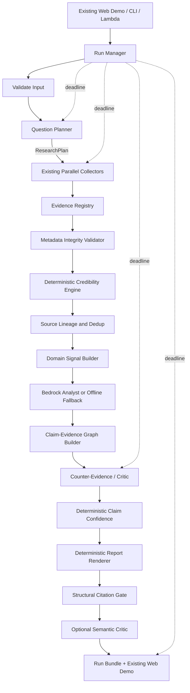
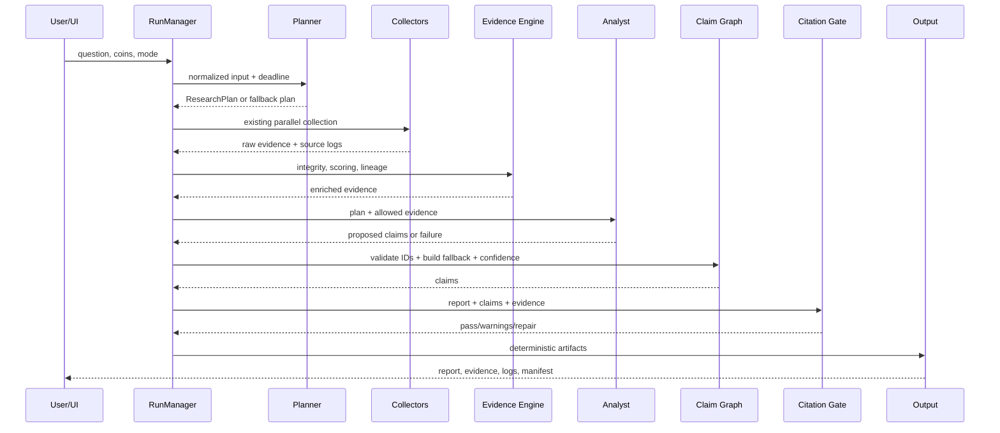

# Design Document — HoyaBIT Competition-Ready Upgrade

## 1. Design Goal

本設計沿用既有 `hoyabit-crypto-research-agent`，補齊競賽規格差距：

1. Amazon Bedrock。
2. Question-driven Research Planner。
3. 可解釋 Evidence credibility。
4. Claim–Evidence Graph。
5. Deterministic Claim confidence。
6. Citation Gate。
7. 完整提交物。
8. Formal Run、deadline 與降級。
9. 現有 Web Demo 展示。

核心決策是「擴充既有垂直切片」，而不是建立新架構。

---

## 2. Existing-System Assumptions

T0 必須以實際 repository 驗證下列假設；若檔名或介面不同，只做最小調整：

- `src/day1_mvp.py`：核心 Evidence／Result schema。
- `src/day2_sources.py`：資料來源與平行 Collector。
- `src/orchestrator.py`：主流程、offline reasoning、Critic、輸出。
- `src/llm.py`：LLM provider adapter。
- `src/validation.py`：Evidence 與引用驗證。
- `src/app.py`：既有 Web Demo。
- `src/comparison.py`：雙幣比較。
- `lambda_handler.py`：AWS Lambda 入口。
- `aws/template.yaml`：AWS 部署模板。

若 T0 發現介面已改變，T0 應記錄 actual baseline；後續 Task 依相同設計意圖適配，不得藉機重建專案。

---

## 3. Scope Boundaries

### 3.1 In Scope

- Bedrock runtime adapter。
- Structured JSON generation wrapper。
- Planner 與 deterministic fallback。
- Evidence metadata 擴充。
- Credibility score、hard cap 與 source lineage。
- Claim graph、confidence 與 counter-evidence。
- Structural／semantic Citation Gate。
- Competition artifacts。
- Existing Web UI 的局部增量。
- Formal Run 與 deadline。
- Competition tests、backup fixtures、runbook。

### 3.2 Out of Scope

- 新前端框架。
- Step Functions／DynamoDB／向量庫。
- 自主多 Agent 無限迴圈。
- 新交易策略或自動下單。
- 完整歷史機率校準。
- 大量新資料供應商。
- 複雜社群 bot detection。
- PDF。
- 大規模 refactor。

---

## 4. Target Architecture



---

## 5. Component Responsibilities

## 5.1 Run Manager

Suggested new file:

```text
src/run_manager.py
```

Responsibilities:

- Generate unique run ID.
- Distinguish `test` and `formal`.
- Create immutable run directory.
- Record question hash.
- Manage rerun lineage.
- Track hard deadline and internal finalization deadline.
- Prioritize artifact finalization as deadline approaches.
- Preserve partial results.

Suggested states:

```text
CREATED
RUNNING
COMPLETED
COMPLETED_DEGRADED
FAILED
```

---

## 5.2 Bedrock Adapter

Primary integration point:

```text
src/llm.py
```

Configuration:

```text
LLM_PROVIDER=bedrock
BEDROCK_MODEL_ID
AWS_REGION or AWS_DEFAULT_REGION
BEDROCK_MAX_TOKENS
BEDROCK_TEMPERATURE
```

Interface:

```python
generate_json_with_llm(
    prompt: str,
    schema: dict,
    schema_name: str,
    timeout_seconds: float,
) -> dict
```

Behavior:

1. Use `boto3.client("bedrock-runtime")`.
2. Prefer `converse()` for a consistent interface.
3. Parse model text.
4. Validate required fields.
5. Repair/retry at most once.
6. Raise a clear typed exception.
7. Orchestrator catches it and uses fallback.

Unit tests mock the SDK.

IAM:

- Permit only required model-inference actions/resources where feasible.
- Do not embed AWS credentials.
- Keep legacy providers for compatibility, but competition default is Bedrock.

---

## 5.3 Research Planner

Suggested new file:

```text
src/planner.py
```

Output:

```json
{
  "coins": ["BTC"],
  "task_modes": ["describe_market_state", "assess_consistency"],
  "primary_question": "...",
  "time_window": {
    "days": 14,
    "source": "explicit"
  },
  "hypotheses": [],
  "required_domains": ["market", "derivatives", "onchain", "news"],
  "comparison_dimensions": [],
  "assumptions": [],
  "stop_conditions": {
    "max_evidence": 36,
    "max_followup_rounds": 1
  }
}
```

Planner does not issue market conclusions.

Fallback keyword rules:

```text
比較 / vs / 相較       → compare_assets
認為 / 是否 / 支持反對 → test_hypothesis
原因 / 驅動            → explain_driver
一致 / 整合            → assess_consistency
風險                    → identify_risks
值得關注 / 條件         → identify_attention_conditions
default                 → describe_market_state
```

For hypothesis mode, generate symmetrical support and contradiction questions.

For comparison mode, use one shared time window and shared comparison dimensions.

---

## 5.4 Evidence Model

Existing constructor compatibility is mandatory. New fields must be appended with defaults.

Suggested fields:

```python
source_type: str = "unknown"
published_at: str | None = None
event_time: str | None = None
verification_status: str = "unverified"
source_lineage_id: str = ""
claim_relevance: float = 0.0
independence_factor: float = 1.0
score_breakdown: dict = field(default_factory=dict)
score_limiters: list[str] = field(default_factory=list)
related_claim_ids: list[str] = field(default_factory=list)
```

Keep existing `reliability_score` for compatibility; the credibility engine overwrites or enriches the final value.

Source locator may be represented in existing `content_reference` if introducing another field would cause excessive migration. It must still preserve reproducible metadata.

---

## 5.5 Credibility Engine

Suggested new files:

```text
src/credibility.py
config/source_registry.json
```

Formula:

```text
base_score =
  0.30 × source_quality
+ 0.25 × traceability
+ 0.20 × freshness
+ 0.15 × method_transparency
+ 0.10 × independence
```

Output:

```json
{
  "raw_score": 0.82,
  "final_score": 0.60,
  "components": {},
  "hard_cap": 0.60,
  "score_limiters": ["single_secondary_news_source"],
  "verification_status": "partially_confirmed",
  "scoring_version": "credibility-v1"
}
```

Hard caps:

```yaml
missing_source_locator: 0.30
missing_fetched_at: rejected
anonymous_or_low_trace_social: 0.35
single_secondary_news_source: 0.60
fallback_fixture: 0.20
unverifiable_entity_attribution: 0.60
unverifiable_intent_attribution: 0.55
```

Freshness uses the Evidence event or publication time when available; `fetched_at` alone is not enough.

---

## 5.6 Source Lineage

Initial implementation is deliberately simple.

Lineage keys may use:

```text
canonical URL
normalized title
original source domain
content hash
quote hash
transaction hash
event ID
```

Independence behavior:

- First root source: full weight.
- Same-organization or direct repost: strongly reduced weight.
- Later items in same lineage: near-zero incremental confirmation.
- Preserve all Evidence records; do not delete duplicates.
- Store lineage for auditability.

---

## 5.7 Claim–Evidence Graph

Suggested new file:

```text
src/claim_graph.py
```

Claim schema:

```json
{
  "claim_id": "CL-001",
  "statement": "...",
  "claim_type": "market_judgment",
  "verdict": "partially_supported",
  "facts": [
    {
      "statement": "...",
      "evidence_ids": ["EV-001"]
    }
  ],
  "inference": "...",
  "conclusion": "...",
  "supporting_evidence_ids": ["EV-001"],
  "contradicting_evidence_ids": ["EV-008"],
  "confidence": {
    "score": 0.68,
    "level": "medium",
    "type": "heuristic",
    "components": {},
    "limiters": []
  },
  "limitations": [],
  "invalidation_conditions": [],
  "watchpoints": []
}
```

The Analyst may propose claim text and evidence relationships. Python must validate Evidence IDs and compute final confidence.

Deterministic fallback uses the existing signal inventory if LLM claim output is invalid.

---

## 5.8 Claim Confidence

Formula:

```text
confidence =
  0.30 × weighted_evidence_quality
+ 0.25 × domain_coverage
+ 0.20 × source_diversity
+ 0.15 × signal_consistency
+ 0.10 × counter_evidence_coverage
```

Rules:

```text
one supporting domain                 → cap 0.60
strong support and contradiction      → cap 0.70
domain coverage below 0.40            → insufficient_evidence
fallback-only primary support         → insufficient_evidence
Critic adjustment                     → can only reduce
```

The score is heuristic, not a calibrated prediction probability.

---

## 5.9 Citation Gate

### Structural Gate

Validate:

- Evidence ID exists.
- Evidence belongs to current run.
- Required metadata exists.
- Evidence is not rejected.
- Related Claim ID matches.
- Fallback is not sole primary support.
- Confidence respects caps.
- Supporting and contradicting relations are coherent.

### Semantic Critic

Classifications:

```text
over_claim
unsupported
ignored_counter
stale_or_weak
correlation_as_causation
official_statement_as_outcome
onchain_transfer_as_intent
confidence_too_high
```

Critic can:

- Add warnings.
- Recommend conservative wording.
- Reduce confidence.

Critic cannot:

- Add Evidence.
- Increase confidence.
- Modify Raw Evidence.
- Block all output when structural gate already passes.

---

## 5.10 Report and Run Bundle

Report rendering must be deterministic.

Required sections:

1. Analysis target and question.
2. Data cutoff and window.
3. Market judgment.
4. Key evidence.
5. Fact → Inference → Conclusion.
6. Supporting and contradicting evidence.
7. Cross-source consistency.
8. Confidence components.
9. Known limitations.
10. Invalidation conditions.
11. Watchpoints.
12. Evidence summary.

Output directory:

```text
runs/{run_id}/
├── report.md
├── evidence.json
├── execution_log.json
├── research_plan.json
├── claims.json
└── manifest.json
```

Manifest:

- Run metadata.
- Provider/model.
- Code commit.
- Config/scoring versions.
- File hashes.
- Validation status.
- Rerun lineage.

---

## 5.11 Web Demo

Do not replace the current framework.

Add or expose:

- Research Plan.
- Claim cards.
- Fact/Inference/Conclusion.
- Supporting/contradicting Evidence.
- Confidence breakdown.
- Hard-cap limiters.
- Evidence traceability.
- Execution Log.
- Artifact links.

Compatibility:

- Missing new fields display `N/A`.
- Old fixtures do not crash.
- Static report remains a fallback.

---

## 6. Execution Flow



---

## 7. Deadline Strategy

Official hard limit:

```text
900 seconds
```

Internal finalization deadline:

```text
840 seconds
```

As remaining time drops:

1. Stop optional follow-up search.
2. Skip semantic Critic if necessary.
3. Do not start another LLM repair.
4. Build Claims from available Evidence.
5. Render conservative report.
6. Save all artifacts and hashes.

Existing more conservative phase budgets should remain unless T0 demonstrates they prevent valid completion.

---

## 8. Fault-Tolerance Strategy

| Failure | Required behavior |
|---|---|
| Planner invalid JSON | deterministic plan fallback |
| One Collector timeout | mark missing, continue |
| On-chain unavailable | disclose gap, reduce coverage |
| News empty | disclose gap, continue |
| Bedrock unavailable | deterministic offline analysis |
| Analyst invalid claim IDs | reject IDs, build fallback claims |
| Semantic Critic timeout | structural gate + conservative report |
| UI failure | use report and JSON artifacts |
| Approaching deadline | finalize partial auditable result |

---

## 9. Security Design

- No secrets in source or steering.
- Use normal AWS credential chain.
- Least-privilege Bedrock inference permission.
- External content is untrusted data and must never be treated as instructions.
- Raw source content must not be allowed to override system prompts.
- Log query metadata, not credentials.
- Bound quotes and response payloads to avoid excessive artifact size.

---

## 10. Testing Strategy

Per Task:

```text
targeted unit
→ targeted integration
→ full suite
→ offline end-to-end
```

T8 additionally:

- One live Bedrock smoke.
- One Web smoke.
- One comparison smoke.
- Failure injection.
- Demo backup fixtures.
- Runtime measurement.

Tests must not require live external services by default.

---

## 11. File Change Plan

| Task | Primary changes |
|---|---|
| T0 | baseline docs only |
| T1 | `src/llm.py`, Lambda/env/AWS template, tests |
| T2 | new `src/planner.py`, Orchestrator integration, tests |
| T3 | new `src/credibility.py`, source registry, Evidence compatibility, tests |
| T4 | new `src/claim_graph.py`, Analyst integration, tests |
| T5 | validation, deterministic renderer, artifacts, manifest, tests |
| T6 | local additions to `src/app.py`, UI tests |
| T7 | new `src/run_manager.py`, deadline/run integration, tests |
| T8 | competition tests, docs, backup fixtures |

---

## 12. Requirement Traceability

| Requirement | Main Tasks |
|---|---|
| R1 Preserve MVP | T0–T8 |
| R2 Baseline | T0 |
| R3 Bedrock | T1 |
| R4 Planner | T2 |
| R5 Traceable Evidence | T3, T5 |
| R6 Credibility | T3 |
| R7 Lineage/Semantics | T3, T5 |
| R8 Claim Graph | T4 |
| R9 Claim Confidence | T4 |
| R10 Citation Gate | T5 |
| R11 Artifacts | T5 |
| R12 Web Demo | T6 |
| R13 Formal Run | T7 |
| R14 Fault Tolerance | T1–T8 |
| R15 Test and Freeze | T8 |

---

## 13. Delivery Milestones

```text
T0 PASS → baseline protected
T1 PASS → competition LLM provider supported
T2 PASS → question-driven research
T3 PASS → explainable Evidence quality
T4 PASS → auditable reasoning and confidence
T5 PASS → minimum competition-ready core
T6 PASS → judge-friendly presentation
T7 PASS → formal-run lifecycle and deadline
T8 PASS → frozen demo-ready release
```
