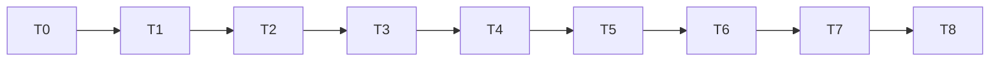

# Implementation Plan — HoyaBIT Competition-Ready Upgrade

> **Execution mode:** Manual, one Task at a time.  
> Do not use Run All Tasks for this time-boxed upgrade.  
> Each Task has a mandatory gate and must stop before the next Task.

Before every Task:

1. Read the corresponding detail file under `docs/competition-tasks/`.
2. Confirm dependencies are `PASS` in `docs/COMPETITION_TASK_STATUS.yaml`.
3. Update current status to `IN_PROGRESS`.
4. Follow workspace steering.
5. Complete implementation, tests, status update, and commit.
6. Stop.

---

- [x] T0. Freeze the existing competition-upgrade baseline
  - Read `docs/competition-tasks/T0-baseline.md`.
  - Verify current tests, offline end-to-end output, and Web startup.
  - Create or use branch `hackathon/competition-ready`.
  - Record actual baseline in `docs/COMPETITION_BASELINE.md`.（已完成：commit `b38c433`，另見
    `.kiro/steering/competition-baseline.md`；本 repo 的 `docs/COMPETITION_BASELINE.md` 為已填寫版本，
    未被套件的空白樣板覆蓋。）
  - Do not implement product features.
  - _Requirements: 1.1, 1.2, 1.3, 2.1, 2.2, 2.3, 2.4_
  - _Depends: none_
  - _Commit: `chore(T0): freeze competition upgrade baseline`_
  - _Stop after Task: mandatory_

- [x] T1. Add the Amazon Bedrock LLM provider
  - Read `docs/competition-tasks/T1-bedrock.md`.
  - Add Bedrock without removing legacy providers or offline fallback.
  - Add structured JSON helper, mocked tests, Lambda/env/IAM compatibility.
  - Verify Bedrock failure falls back safely.
  - _Requirements: 1.1, 1.2, 3.1, 3.2, 3.3, 3.4, 3.5, 3.6, 14.2_
  - _Depends: T0 PASS_
  - _Commit: `feat(T1): add Amazon Bedrock LLM adapter`_ (`6cf3905`)
  - _Stop after Task: mandatory_

- [x] T0.5. Freeze the LLM and Artifact Storage boundaries（計畫外插入的 Task，由使用者指派）
  - 目的：在接真實 Bedrock 與 S3 之前先固定介面，讓後續 Task 不必大規模重構。
  - 新增 `src/ports.py`（`LLMClient`、`ArtifactStore` Protocol）、`src/artifact_store.py`
    （`LocalArtifactStore` + SHA-256 manifest）、`src/run_context.py`（`RunContext` 與凍結的環境變數名稱）。
  - `src/llm.py` 新增 `ExistingLLMClient`／`OfflineLLMClient`，`analyze_with_llm()`／`critique_with_llm()`
    可注入 client；預設行為不變。
  - 未實作真實 Bedrock 呼叫、S3 上傳、CloudFormation 或 IAM；Orchestrator 尚未改接 ArtifactStore。
  - _Depends: T1 PASS_
  - _Commit: `refactor(T0.5): define llm and artifact storage boundaries`_ (`f0530c5`)
  - _Stop after Task: mandatory_

- [ ] T2. Add question-driven Research Planning
  - Read `docs/competition-tasks/T2-planner.md`.
  - Add ResearchPlan schema, Bedrock Planner, deterministic fallback, shared comparison plan, and `research_plan.json`.
  - Do not rewrite Collector selection in this Task.
  - _Requirements: 4.1, 4.2, 4.3, 4.4, 4.5, 4.6, 4.7, 14.3_
  - _Depends: T1 PASS_
  - _Commit: `feat(T2): add question-driven research planner`_
  - _Stop after Task: mandatory_

- [ ] T3. Add explainable Evidence credibility and source lineage
  - Read `docs/competition-tasks/T3-credibility.md`.
  - Extend Evidence compatibly.
  - Add deterministic score components, hard caps, verification status, source registry, and lineage.
  - Do not let the LLM set final scores.
  - _Requirements: 5.1, 5.2, 5.3, 5.4, 5.5, 5.6, 6.1, 6.2, 6.3, 6.4, 6.5, 6.6, 7.1, 7.2, 7.3, 7.4, 7.5_
  - _Depends: T2 PASS_
  - _Commit: `feat(T3): add explainable evidence credibility engine`_
  - _Stop after Task: mandatory_

- [x] T4. Build the Claim–Evidence Graph and deterministic Claim confidence
  - Read `docs/competition-tasks/T4-claim-graph.md`.
  - Add Fact/Inference/Conclusion separation.
  - Add supporting and contradicting Evidence, verdict, confidence, limitations, invalidation conditions, and watchpoints.
  - Save `claims.json`.
  - _Requirements: 8.1, 8.2, 8.3, 8.4, 8.5, 8.6, 9.1, 9.2, 9.3, 9.4, 9.5, 9.6, 9.7_
  - _Depends: T3 PASS_
  - _Commit: `feat(T4): add claim evidence graph and confidence engine`_
  - _Stop after Task: mandatory_

- [x] T5. Enforce Citation Gates and produce the complete competition bundle
  - Read `docs/competition-tasks/T5-citation-output.md`.
  - Add structural and semantic validation.（`run_citation_gate()` 十條規則 + `detect_semantic_risks()`
    八類 deterministic 語意偵測，Critic prompt 同步擴充到八類。）
  - Add deterministic report rendering, manifest hashes, complete Execution Log, and six required artifacts.
  - Ensure Critic failure cannot remove all output.（Critic 逾時仍產出六檔，報告明示語意稽核未執行。）
  - _Requirements: 5.1, 5.2, 5.3, 8.2, 10.1, 10.2, 10.3, 10.4, 10.5, 10.6, 10.7, 11.1, 11.2, 11.3, 11.4, 11.5, 14.4_
  - _Depends: T4 PASS_
  - _Commit: `feat(T5): enforce citation gate and competition outputs`_
  - _Milestone: Minimum competition-ready core_
  - _Stop after Task: mandatory_

- [ ] T6. Expose Research Plan, Claims, Evidence, confidence, and logs in the existing Web Demo
  - Read `docs/competition-tasks/T6-web-demo.md`.
  - Make minimal additions to the existing UI.
  - Preserve compatibility with old and partial fixtures.
  - Do not redesign the application.
  - _Requirements: 1.3, 12.1, 12.2, 12.3, 12.4, 12.5, 12.6_
  - _Depends: T5 PASS_
  - _Commit: `feat(T6): expose competition evidence and claims in web demo`_
  - _Stop after Task: mandatory_

- [ ] T7. Harden formal-run lifecycle and deadline handling
  - Read `docs/competition-tasks/T7-formal-run.md`.
  - Add unique run directories, formal lock, rerun lineage, deadline manager, partial-result preservation, and finalization priority.
  - _Requirements: 13.1, 13.2, 13.3, 13.4, 13.5, 13.6, 13.7, 13.8, 14.1, 14.5, 14.6_
  - _Depends: T6 PASS_
  - _Commit: `feat(T7): harden formal run lifecycle and deadline handling`_
  - _Stop after Task: mandatory_

- [ ] T8. Execute competition-readiness tests and freeze the demo
  - Read `docs/competition-tasks/T8-demo-freeze.md`.
  - Add five-coin and multi-mode tests, fault injection, live smoke, backup fixtures, runbook, checklist, and final tag.
  - Do not add new product features.
  - _Requirements: 15.1, 15.2, 15.3, 15.4, 15.5, 15.6_
  - _Depends: T7 PASS_
  - _Commit: `test(T8): freeze competition-ready demo`_
  - _Tag after PASS: `competition-demo-ready`_
  - _Stop all feature development after Task: mandatory_

---

## Dependency Graph



## Time-Box Guidance

| Task | Target |
|---|---:|
| T0 | 30 min |
| T1 | 75 min |
| T2 | 60 min |
| T3 | 90 min |
| T4 | 90 min |
| T5 | 75 min |
| T6 | 60 min |
| T7 | 45 min |
| T8 | 90 min |

## Emergency Cut Line

If remaining time becomes critical:

```text
Complete T5.
Skip nonessential T6 polish.
Implement the smallest safe T7 deadline/output protection.
Use T8 only for blocker tests and backup demo.
```
