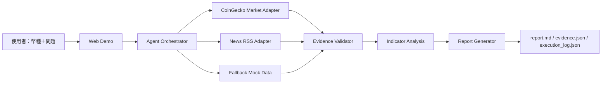

# Agent 團隊 MVP

## 1. 專案目的

輸入幣種與研究問題，於 15 分鐘內產出具備資料來源、Evidence ID、技術指標、新聞／社群訊號與風險提醒的市場研究報告。

## 2. 安裝與執行

需要 Python 3.10+。本專案僅使用 Python 標準函式庫。

```powershell
cd "C:\Users\Vincent\Documents\麥肯錫顧問報告skill\agent團隊"
python -m unittest discover -s tests -v
python -m src.app
```

瀏覽 `http://127.0.0.1:8000`。啟動時會印出 `[llm]` 這行，直接顯示 Gemini 結構化推理是否啟用。
若使用真實資料，呼叫 Orchestrator 時將 `live=True`；失敗時會自動回退至降級證據（可靠度標記為 0.20）。

### 比較分析（兩個幣種）

首頁的「比較幣種」下拉選單選擇第二個幣種後，會走 `run_comparison()`：分別完成兩份完整分析，
再產出「流動性 / 風險敞口 / 市場關注度」三維度並列比較。兩份分析**共用同一組時間預算**，
輸出位於該次執行的 run 目錄 `outputs-day5/runs/<run_id>/`（`comparison.md`、`comparison.json`，
以及每個幣種各自的完整輸出子目錄）。

程式化呼叫：

```python
from pathlib import Path
from src.orchestrator import run_comparison

payload = run_comparison("ETH", "SOL", "比較流動性與風險", Path("outputs-compare"), live=True, use_llm=True)
```

### 時間預算 watchdog

`run()` 與 `run_comparison()` 接受 `time_budget_seconds`（預設 300 秒，遠低於比賽的 15 分鐘上限）：

- 資料收集分配到 70% 的預算，每個來源之間檢查一次 deadline，逾時的來源記為 `<label>:skipped:deadline`
  並填入可靠度 0.20 的降級證據（與 API 失敗的 `:fallback:` 標記刻意區分，以便分辨「網路慢」與「API 掛掉」）。
- 若剩餘時間低於 20 秒，**不會啟動** LLM 呼叫，直接切換至離線推理，執行記錄標記為 `fallback:TimeBudgetExceeded`。
- 相關資訊寫入 `execution_log.json` 的 `time_budget` 欄位，網頁「執行流程」分頁也會顯示。

## 3. API Key 設定

目前所有資料來源（CoinGecko、Google News RSS、alternative.me 恐懼貪婪指數、Federal Reserve RSS、
官方公告 feed、Binance 公開端點、公共 RPC）皆不需要 API Key。

若要啟用真正的 LLM 推理，請複製 `.env.example` 成 `.env`（不要提交到 Git）。`src/app.py` 的
`load_dotenv()` 會在 `serve()` 啟動時載入該檔；**已存在的環境變數優先於 `.env`**，因此在 shell 裡
`$env:GEMINI_API_KEY = "..."` 會覆蓋檔案內容：

```text
LLM_PROVIDER=gemini
GEMINI_API_KEY=your_key_here
GEMINI_MODEL=gemini-3.6-flash

# Alternative provider
OPENAI_API_KEY=your_key_here
OPENAI_MODEL=gpt-4o-mini
```

設定 `LLM_PROVIDER=gemini` 與 `GEMINI_API_KEY` 後，Web Demo 會自動啟用 Gemini 結構化 JSON 推理；未設定 Key 或呼叫失敗時，Orchestrator 會保留 deterministic fallback。若改用 OpenAI，設定 `LLM_PROVIDER=openai` 與 `OPENAI_API_KEY`。

若要使用主辦方五年 OHLCV CSV：

```python
from pathlib import Path
from src.orchestrator import run
run("SOL", "分析近期市場狀況", Path("outputs"), live=True, use_llm=True, ohlcv_path=Path("data/SOL.csv"))
```

程式不得把 Key 寫入報告、Execution Log 或前端畫面。

## 4. Demo 流程

1. 開啟首頁。
2. 輸入 `ETH`。
3. 輸入「近期上漲的主要原因是什麼？」。
4. 按下 Run analysis。
5. 確認摘要、RSI／報酬率／波動率與 Evidence ID。
6. 確認 `outputs-day5/runs/<run_id>/` 或固定 Demo 輸出中的提交物檔案。

### 執行性質與 run 目錄（T7）

首頁的「執行性質」可選 Test 或 Formal：

- 每次執行都會寫入 `outputs-day5/runs/<run_id>/`（`run_id` 形如 `RUN-20260801T012345Z-ETH-1a2b3c4d`），
  既有結果永遠不會被覆寫；`ARTIFACT_ROOT` 環境變數可改變根目錄（Lambda 預設為容器暫存目錄）。
- Formal 對同一「問題＋幣種」組合只允許一次，重複送出會得到 HTTP 409；Test 可任意重複，
  且不會佔用 formal lock。需要重跑正式執行時，必須以授權重跑建立新 run 並填寫理由，
  `manifest.json` 會保留 `rerun_of`／`rerun_reason`／`authorized_rerun`，第一次的紀錄不會被刪除。
- `manifest.json` 與 `execution_log.json` 記錄 run 狀態：`COMPLETED`、`COMPLETED_DEGRADED`
  （例如某個來源失敗、或全部證據都是離線 fixture）或 `FAILED`。
- 硬上限 900 秒、收尾門檻 840 秒是比賽的天花板；本專案仍使用更保守的 720／672 秒。
  進入收尾窗口後不再開始補充蒐集與語意 Critic，優先把六項提交物寫完。

## 5. 架構圖



## 6. 資料來源一覽（皆免金鑰）

| data_type | 來源 | 可靠度 | 備註 |
|---|---|---|---|
| market | CoinGecko market_chart | 0.90 | 14 天價格與成交量 |
| news | Google News RSS | 0.60 | 上限 5 則 |
| macro | alternative.me 恐懼貪婪指數 + Federal Reserve 貨幣政策 RSS | 0.80 | **全市場範圍，非單一幣種**；Fed 為 best-effort，掛掉時降級但不影響恐懼貪婪指數 |
| announcement | 各幣種官方 feed | 0.85 / 0.55 | 見下方說明 |
| onchain | 各鏈公開 RPC | 0.70 | |
| social | Reddit → Bluesky → Hacker News 依序嘗試 | 0.45–0.50 | 上限 25 則 |
| derivatives | Binance 資金費率 | 0.75 | |
| whale | 已知大戶地址餘額 | 0.65 | 僅支援 BTC/ETH/BNB |
| vegas_channel | Binance klines + Vegas 通道策略 | 0.70 | 4H 趨勢 / 1H 執行 |
| long_short_ratio | Binance 大戶持倉多空比 | 0.70 | |
| tvl | DefiLlama 鏈上鎖倉量 | 0.75 | 90 天日資料；BTC/ETH/BNB/SOL/XRP 各對應自己的鏈 |
| price_history | 本地 5 年日線 CSV（`data/<COIN>.csv`） | 0.95 | 非 API 來源；提供 14d/90d/365d/全期間的報酬、年化波動、最大回撤與價格區間分位 |

官方公告 feed 的可靠度分兩級，這個區別在證據表中是看得見的：

- **第一方 feed（0.85）**：ETH（Ethereum Foundation Blog）、BTC（Bitcoin Optech）、SOL（Solana 官方新聞）。
- **官方網域限定的新聞聚合（0.55）**：XRP、BNB。Ripple 與 BNB Chain 沒有可用的公開 RSS
  （`ripple.com/insights/feed` 為 404、`bnbchain.org/en/blog/feed` 回傳 HTML、Binance 公告 feed 在
  機器人防護後回 202 空 body），因此改用限定於官方網域的 Google News feed，屬二手轉載而非第一方來源。

## 7. 已知限制

- MVP 預設分析期間為 14 天。
- MVP 輸入驗證已支援 BTC、ETH、SOL、BNB、XRP；每個幣種的即時鏈上 provider 仍可能依公開 API 狀態 fallback。
- 巨鯨錢包追蹤僅支援 BTC/ETH/BNB；SOL 與 XRP 缺乏免金鑰的驗證地址餘額 API，會回傳降級證據。
- 比較模式的關注度維度：新聞／公告／貼文則數受抓取上限限制（5/5/25），兩個熱門幣種會同時觸頂，
  因此排名以**無上限的社群互動總量**為準，則數僅作覆蓋度參考。
- 流動性維度使用成交額作為 proxy，非訂單簿深度；免金鑰端點不提供買賣價差。
- 技術指標（RSI、報酬、波動）仍以 14 天窗口計算，與其他即時來源對齊；5 年日線 CSV 另外以
  `price_history` 證據提供長期脈絡（報酬／波動／回撤／價格區間分位），兩者刻意分開而不互相取代。
- 立場標籤（偏多／中性／偏空）由證據訊號加權決定，不是模型自由生成：方向性權重需達 1.5、
  且單邊淨優勢需超過 25% 才會給出方向，否則一律為中性。離線模式與線上模式得到相同結果。
- TVL 只涵蓋該幣自身的鏈，對本身沒有 DeFi 生態的資產（如 XRP）參考價值有限。
- RSS 內容可能受來源格式與網路狀態影響。
- 報告是研究輔助，不是投資建議。

## AWS 部署

先完成 `aws login`，若已在 Secrets Manager 建立 LLM Key，取得其 ARN 後執行：

```powershell
powershell.exe -NoProfile -ExecutionPolicy Bypass -File .\aws\deploy.ps1 -Region ap-northeast-1 -LLMProvider gemini -LLMSecretArn "arn:aws:secretsmanager:..."
```

Secrets Manager 的 SecretString 建議使用 JSON：

```json
{"LLM_PROVIDER":"gemini","GEMINI_API_KEY":"your_key_here","GEMINI_MODEL":"gemini-3.6-flash"}
```

腳本會建立 Lambda、公開 Function URL、CloudWatch Logs、IAM Role 與必要權限。架構與風險請見 `docs/aws-architecture.md`。
