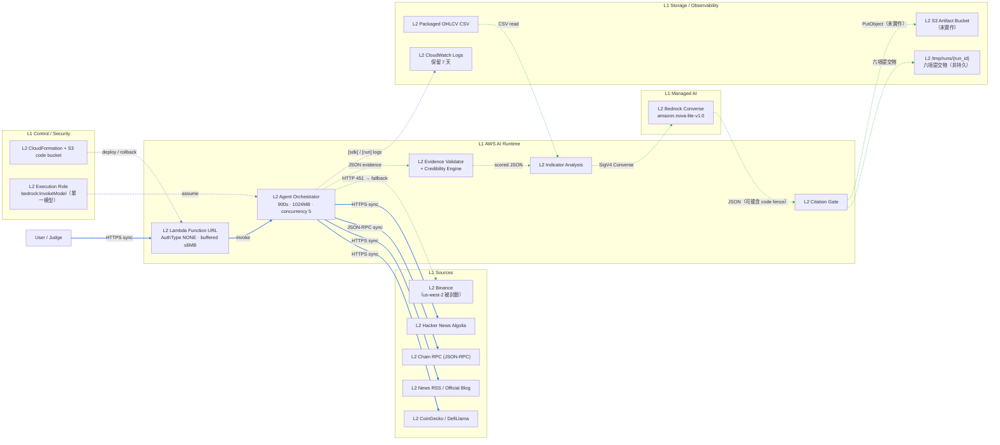

# AWS Solution Architecture Overview

> **狀態（2026-08-01）**：已實際部署並驗收。本文件描述的是**已部署驗證**的架構，
> 與「模板中有定義但未驗證」的部分明確區分——後者一律標為「未驗證」或「可選」。
>
> 部署細節、任務清單與權限開通引導見 `.kiro/specs/hoyabit-aws-deployment/`；
> 操作說明見 `aws/README.md`。

## 已部署驗證的事實

| 項目 | 值 |
|---|---|
| Account | `<ACCOUNT_ID>`（AWS Workshop Studio 臨時環境） |
| Region | `us-west-2` |
| Stack | `hoyabit-agent-mvp`，`UPDATE_COMPLETE`，6 個資源 |
| 進入點 | Lambda Function URL，`AuthType: NONE` |
| Runtime | `python3.12`，Timeout **900 秒**，Memory 1024 MB |
| Reserved concurrency | 5（帳號 unreserved 由 110 降為 105） |
| Log 保留期 | 7 天 |
| LLM Provider | **Amazon Bedrock**，`amazon.nova-lite-v1:0`，Converse API |
| Lambda 內建 SDK | botocore 1.42.97，Converse 可用（未打包額外 SDK） |
| 部署套件 | 377 KB 壓縮 / 1.2 MB 解壓 |
| 實測回應 | 單幣 94–120 KB，17–43 秒（Function URL buffered 上限 6 MB） |

## Assumptions

- 比賽 Demo 是低併發、單次最長 15 分鐘的分析工作。Lambda 的 900 秒上限高於
  Orchestrator 的 720 秒三階段天花板，因此不會在執行中被砍。
- 公開 Function URL 僅用於競賽展示。**任何取得 URL 的人都能觸發完整執行並消耗
  Bedrock 配額**；成本上限靠 reserved concurrency，最終收斂手段是 `delete-stack`。
- 五種 OHLCV CSV 隨 Lambda deployment package 發布；資料包更新時重新部署版本。
- Bedrock 透過 Lambda execution role 認證，**不使用 API key，也不讀 Secrets Manager**。
  Gemini／OpenAI 路徑保留，那兩者才需要 Secrets Manager。

## Logical zones and L1/L2 responsibilities

| L1 Zone | L2 Component | Responsibility | 狀態 |
|---|---|---|---|
| Sources | CoinGecko / News RSS / Chain RPC / HN Algolia / DefiLlama | 市場、新聞、鏈上與公開討論資料 | 已驗證 |
| Sources | Binance（derivatives / klines / long-short） | 衍生品與技術面資料 | **在 us-west-2 被地理封鎖，一律 fallback** |
| AI Runtime | Lambda Agent Orchestrator | 輸入解析、工具調用、Evidence 驗證、指標與推理 | 已驗證 |
| AI Runtime | Amazon Bedrock Converse | Fact → Inference → Conclusion 結構化推理與 Critic 稽核 | 已驗證 |
| Storage | Packaged OHLCV CSV | 五種幣近五年 Daily OHLCV fallback／基準資料 | 已驗證 |
| Storage | Container `/tmp/runs/{run_id}/` | 六項提交物落點 | 已驗證（**非持久**） |
| Storage | S3 Artifact Bucket | 執行結束後仍可取得產物 | **未實作**（D6） |
| Storage | CloudWatch Logs | 執行狀態、`[sdk]` 與 `[run]` 摘要、錯誤與延遲 | 已驗證 |
| Application | Lambda Function URL | 公開 Web Form 與 JSON API | 已驗證 |
| Control Plane | CloudFormation + S3 code bucket | 可重現部署、版本更新與 rollback | 已驗證 |
| Security | IAM execution role | 最小權限：僅 `bedrock:InvokeModel` 於單一 foundation model | 已驗證 |
| Security | AWS Budgets | 成本告警 | **未建立**（D7 待人工執行） |

## End-to-end flow

1. 使用者透過 HTTPS 同步提交幣種、研究問題與執行性質（`test`／`formal`）。
2. `RunManager` 建立唯一 `run_id` 與獨立輸出目錄；`formal` 重複送出回 **409**（已驗證）。
3. Orchestrator 以 HTTPS 並行取得市場、新聞、鏈上、社群與衍生品證據。
   單一來源失敗改用可靠度 0.20 的 fallback fixture 並記入 `degradation_reasons`。
4. 每筆 Evidence 正規化為 JSON，含 source locator、`fetched_at`、`content_reference`
   與 `related_claim_ids`；`credibility` 引擎以 deterministic 規則計分並套用 hard caps。
5. Bedrock Converse 執行結構化推理與 Critic 稽核。**模型輸出的 JSON 可能被 markdown
   code fence 包裹**，因此 adapter 會剝除最外層 fence（見 `src.llm.strip_json_fence`）。
6. Claim confidence 一律由 deterministic Python 計算，模型不決定最終分數。
7. Citation Gate 十一項檢查通過後產出六項提交物，`manifest.json` 收錄五個 SHA-256。
8. Lambda 回傳 HTML 或 JSON（含六項提交物與 `sdk_capability`），並輸出一行
   `[run]` JSON 摘要到 CloudWatch 供回溯。

藍實線為請求與資料主路徑，綠虛線為證據與產物流，紫虛線為控制與安全平面。
虛線方框或標註「未實作」的元件尚未部署，不得視為已驗證。

## Key risks

| 風險 | 狀態 | 處置 |
|---|---|---|
| 公開端點被大量呼叫 | 存在 | reserved concurrency 5 為硬上限；Demo 後 `delete-stack` |
| Binance 在美國 region 被封鎖 | **已發生** | 8/11 collector 成功，其餘 fallback 並誠實標示；per-source 隔離機制正常運作 |
| Bedrock 回應非合法 JSON | **已發生並修復** | `strip_json_fence()` 剝除 markdown fence；prompt 同步要求不使用 fence |
| Lambda SDK 不支援 Converse | 未發生 | `sdk_capability` 在首頁、JSON 回應與 log 三處顯示；`deploy.sh --bundle-sdk` 備用 |
| 回應超過 6 MB buffered 上限 | 未發生 | 實測 94–120 KB；若超限則改回傳產物參照 |
| 產物隨容器回收消失 | 存在 | 目前僅在 `/tmp`；持久化待 D6 的 `S3ArtifactStore` |
| 成本異常無告警 | 存在 | Budgets 待人工建立；防止機制已由 concurrency 上限達成 |
| 憑證失效 | 必然 | Workshop Studio 為臨時環境，活動結束即回收；`live-success/` fixture 為靜態檔案可獨立驗證 |

## 與本機執行的差異

| 面向 | 本機 | AWS Lambda |
|---|---|---|
| 進入點 | `python -m src.app`（`127.0.0.1:8000`） | Function URL → `lambda_handler.handler` |
| UI 範圍 | 完整（首頁、報告、比較、回測、`/artifact`） | 精簡表單與 JSON API |
| Binance 來源 | 可用（實測 HTTP 200） | 被封鎖，一律 fallback |
| 產物落點 | `outputs-day5/runs/{run_id}/` | `/tmp/runs/{run_id}/`（非持久） |
| Collector 成功數 | 11/11 | 8/11 |

完整 Web UI 刻意不上雲：`src/app.py` 綁定 `127.0.0.1` 且使用標準庫 `ThreadingHTTPServer`，
搬上 Lambda 需要 Web Adapter 或改用容器服務，而這不會改善任何競賽驗收項目。
