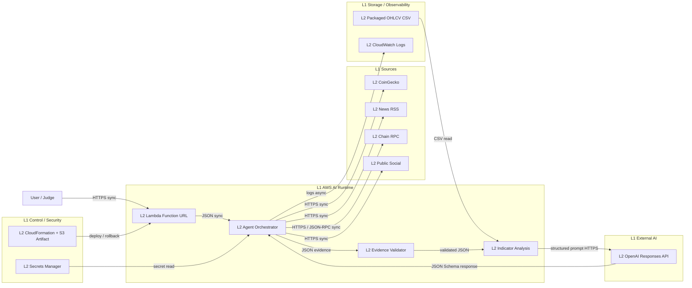

# AWS Solution Architecture Overview

## Assumptions

- 比賽 Demo 是低併發、單次最長 15 分鐘的分析工作。
- 公開 Function URL 僅用於競賽展示；正式產品應改為 API Gateway + Cognito/WAF。
- 五種 OHLCV CSV 隨 Lambda deployment package 發布；資料包更新時重新部署版本。
- OpenAI API Key 儲存在 AWS Secrets Manager，不寫入程式碼、Git 或 CloudFormation 明文。

## Logical zones and L1/L2 responsibilities

| L1 Zone | L2 Component | Responsibility |
|---|---|---|
| Sources | CoinGecko / News RSS / Chain RPC / HN Algolia | 即時市場、新聞、鏈上與公開討論資料 |
| AI Runtime | Lambda Agent Orchestrator | 輸入解析、工具調用、Evidence 驗證、指標與推理 |
| AI Runtime | OpenAI Responses API | Fact → Inference → Conclusion 結構化推理 |
| Storage | Packaged OHLCV CSV | 五種幣近五年 Daily OHLCV fallback／基準資料 |
| Storage | CloudWatch Logs | 執行狀態、錯誤、延遲與 fallback 觀測 |
| Application | Lambda Function URL | 公開 Web Form 與 JSON API |
| Control Plane | CloudFormation + S3 artifact | 可重現部署、版本更新與 rollback |
| Security | IAM + Secrets Manager | 最小權限與金鑰保護 |

## End-to-end flow

1. 使用者透過 HTTPS 同步提交幣種與臨時題目。
2. Lambda Orchestrator 以 HTTPS 並行／依序取得市場、新聞、鏈上及社群證據。
3. 每筆 Evidence 正規化為 JSON，包含 URL、fetched_at、content_reference 與 related_claim。
4. 指標模組讀取 OHLCV CSV 或即時價格，計算報酬率、波動率與 RSI。
5. 若 Secrets Manager 有 OpenAI Key，Orchestrator 以 HTTPS 同步呼叫 Responses API；否則使用明確標記的 deterministic fallback。
6. Lambda 回傳 HTML 或 JSON，並將執行狀態寫入 CloudWatch Logs。

## Key risks

- Public URL has no authentication and can create API cost; after competition, restrict access or delete the stack.
- Lambda synchronous timeout is set to 300 seconds, below the competition's 15-minute ceiling but above Function URL client patience; use Step Functions for longer production jobs.
- Public data providers may rate-limit or change schemas; Execution Log and fallback remain mandatory.
- Packaged CSV increases artifact size and becomes stale; production should move versioned datasets to S3.
- Current single Lambda has no queue or concurrency guard; production should add reserved concurrency, idempotency key and cost alarms.
